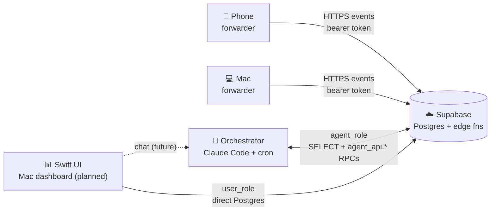
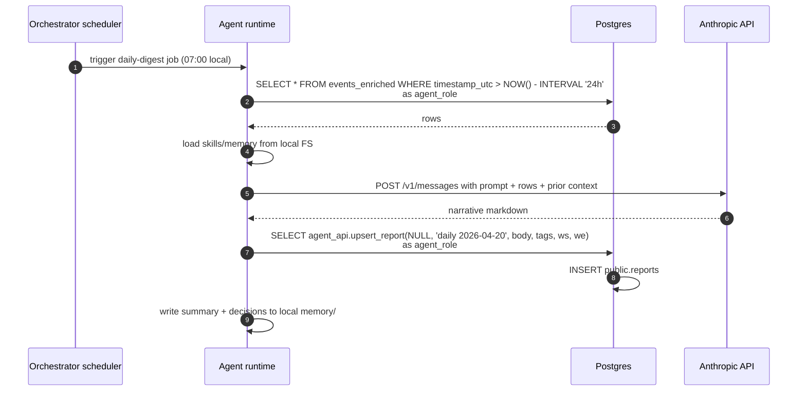
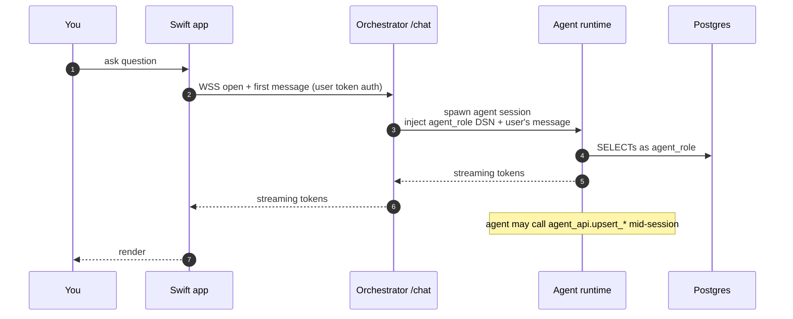
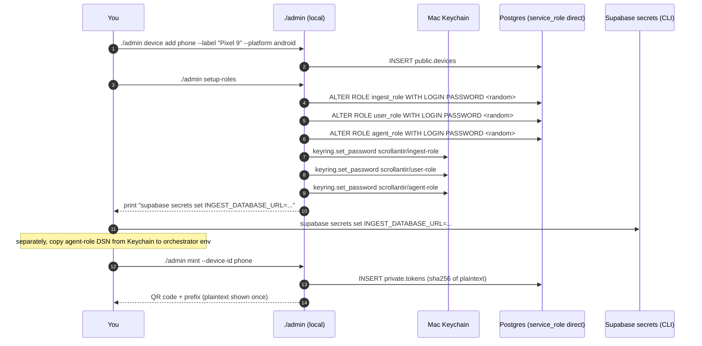

# Scrollantir — Data flow and runtime placement

The end-to-end picture of what runs where, who talks to whom, and with
which credential. Written to be picked up cold: a future agent or
future-you should be able to read this one doc and know where every
piece of work lives. Deep-dive references live in the per-component
docs (`supabase.md`, `edge-functions.md`, `admin-cli.md`, etc.).

## TL;DR

Four planes of runtime, strictly separated:

1. **Devices** (phone, Mac) — collect events into a local durable queue
   and forward to Supabase. No LLM, no reasoning.
2. **Supabase edge functions** — the thin authenticated write path.
   Deno, stateless, co-located with Postgres. Handles ingest +
   prompt-answer + pending-prompts. No LLM calls.
3. **Postgres (Supabase)** — system of record. All business logic that
   must be atomic (token validation, rate limiting, prompt answer
   round-trip) lives in `ingest_api.*` and `agent_api.*` SQL functions.
4. **Orchestrator** (cheap always-on VPS or container) — the *only*
   place that runs an LLM-driven agent. Owns scheduled jobs
   (daily-digest, weekly-report, classifier, prompt-asker), serves
   interactive chat to the Mac dashboard, and keeps a local filesystem
   for skills + memory. Credentialed as `agent_role`; bounded blast
   radius.

Plus the **Admin CLI** (your local Mac only, `service_role`) for
device + token + role-password lifecycle. That's in its own plane
because it's the root-of-trust tool and never runs automated.

Runtime for the orchestrator is **Claude Code CLI in a Docker
container** on Hetzner CAX11 + systemd (deployed 2026-04-21). Not a
bespoke Python agent loop — the CLI already implements tool-use,
streaming, self-correction, and has a skills/memory filesystem
convention we can lean on. See `docs/orchestrator.md` for image
contents, deployment, and per-job prompts.

## Five-entity view

The 10,000-ft picture, nothing else:



Everything else on this page is a zoom-in on one of those arrows.

## Status

| Plane | State |
|---|---|
| Android collector | ✅ built; posting to Supabase via QR-onboarding (roadmap #4 shipped 2026-04-21). Location + activity tracking + prompts inbox + QR scanner all live. |
| Mac collector + forwarder | ✅ launchd every 30 s → Supabase `/functions/v1/ingest`. Hostname-agnostic uuid5; hold-the-tail discipline (2026-04-25) for correct durations. |
| Supabase schema v3 | ✅ deployed + three 2026-04-21 hot-patches (pgcrypto schema qualifier, rate-counter on actual-insert only, `events_enriched` re-grant). |
| Admin CLI | ✅ shipped 2026-04-21; roles assigned, devices registered, tokens minted. |
| Edge functions (ingest / prompt-answer / pending-prompts) | ✅ deployed with `--no-verify-jwt`. |
| Orchestrator (server + agent runtime) | ✅ Phases 0–2 shipped (Hetzner CAX11 + systemd + Docker + cron); daily-digest + weekly-report cron-firing. Classifier deferred to roadmap #8. |
| Web dashboard (Vite + React + TS) | 🚧 in progress at `dashboard/`; SwiftUI scaffold at `macos/` parked 2026-04-21. |

## System diagram

```mermaid
flowchart TB
  %% ═════════ Devices ═════════
  subgraph PHONE["📱 Phone (Android 14+)"]
    direction TB
    PhoneTracker["TrackerForegroundService<br/>→ Room DB local queue"]
    PhoneForwarder["ForwarderWorker<br/>(every 15 min)"]
    PhonePromptUI["Prompt inbox UI<br/>(polls + answers)"]
    PhoneTracker --> PhoneForwarder
  end

  subgraph MAC["💻 Mac (Josh's laptop)"]
    direction TB
    AW["ActivityWatch<br/>→ local SQLite"]
    MacForwarder["Mac Forwarder<br/>(launchd, every 15 min)"]
    SwiftDash["Swift Dashboard<br/>(planned)"]
    AdminCLI["Admin CLI<br/>scripts/admin.py"]
    Keychain[("Mac Keychain<br/>scrollantir/service-role*<br/>scrollantir/user-role<br/>scrollantir/agent-role<br/>scrollantir/ingest-role")]
    AW --> MacForwarder
    AdminCLI -- "writes" --> Keychain
    SwiftDash -- "reads" --> Keychain
  end

  %% ═════════ Supabase managed ═════════
  subgraph SUPABASE["☁️ Supabase (managed)"]
    direction TB
    subgraph EDGE["Edge Functions (Deno)"]
      IngestFn["POST /functions/v1/ingest"]
      PromptAnsFn["POST /functions/v1/prompt-answer"]
      PendingFn["GET /functions/v1/pending-prompts"]
    end
    subgraph PG["Postgres (private + public + *_api schemas)"]
      direction TB
      IngestAPI["ingest_api.accept_event<br/>ingest_api.accept_prompt_answer<br/>ingest_api.pending_prompts"]
      AgentAPI["agent_api.upsert_report<br/>agent_api.upsert_annotation<br/>agent_api.create_prompt<br/>agent_api.soft_delete_*"]
      PubTables[("public.events<br/>public.devices<br/>public.reports<br/>public.annotations<br/>public.prompts<br/>public.source_tags")]
      PrivTables[("private.tokens<br/>private.ingest_rate_limit")]
      EnrichView(["public.events_enriched (view)"])
      IngestAPI --> PubTables
      IngestAPI --> PrivTables
      AgentAPI --> PubTables
      EnrichView -.-> PubTables
    end
    EdgeSecrets[("Function secrets<br/>INGEST_DATABASE_URL")]
    IngestFn -- "as ingest_role" --> IngestAPI
    PromptAnsFn -- "as ingest_role" --> IngestAPI
    PendingFn -- "as ingest_role" --> IngestAPI
    EDGE -.reads.-> EdgeSecrets
    PgCron["pg_cron:<br/>token-cleanup hourly,<br/>superseded-token auto-revoke"] --> PrivTables
  end

  %% ═════════ Orchestrator ═════════
  subgraph ORCH["🧠 Orchestrator (Docker + systemd on Hetzner CAX11)"]
    direction TB
    OrchCron["cron<br/>0 7 * * *   daily-digest<br/>0 9 * * 0   weekly-report<br/>*/15 * * * *  classifier"]
    OrchCLI["claude -p '...'<br/>(Claude Code CLI, headless)"]
    OrchFS[("Persistent volume:<br/>/scrollantir/CLAUDE.md<br/>/scrollantir/jobs/*.md<br/>/scrollantir/skills/<br/>/scrollantir/memory/")]
    OrchEnv[("Env secrets (/etc/scrollantir.env, mode 600):<br/>CLAUDE_CODE_OAUTH_TOKEN or ANTHROPIC_API_KEY<br/>AGENT_DATABASE_URL")]
    OrchCron --> OrchCLI
    OrchCLI -- "reads conventions,<br/>writes memory" --> OrchFS
    OrchCLI -. "reads" .-> OrchEnv
  end

  %% ═════════ LLM providers ═════════
  subgraph LLMS["🤖 LLM providers (HTTPS API)"]
    Anthropic["Anthropic<br/>(Claude — main reasoning)"]
    Groq["Groq / Cerebras<br/>(fast+cheap — classifier)"]
  end

  %% ═════════ Arrows: device → Supabase ═════════
  PhoneForwarder -. "HTTPS POST events<br/>Bearer: phone token" .-> IngestFn
  PhonePromptUI -. "HTTPS GET pending<br/>Bearer: phone token" .-> PendingFn
  PhonePromptUI -. "HTTPS POST answer<br/>Bearer: phone token" .-> PromptAnsFn
  MacForwarder -. "HTTPS POST events<br/>Bearer: mac token" .-> IngestFn

  %% ═════════ Arrows: local Mac → Supabase ═════════
  AdminCLI == "service_role<br/>direct Postgres :5432" ==> PG
  SwiftDash -- "user_role<br/>direct Postgres :5432" --> PubTables

  %% ═════════ Arrows: Swift ↔ orchestrator (future; transport TBD) ═════════
  SwiftDash -. "chat (future)" .-> OrchCLI

  %% ═════════ Arrows: orchestrator → Supabase ═════════
  OrchCLI -- "agent_role SELECT<br/>direct Postgres :5432" --> EnrichView
  OrchCLI -- "agent_role SELECT" --> PubTables
  OrchCLI -- "agent_role EXECUTE<br/>singleton RPCs" --> AgentAPI

  %% ═════════ Arrows: orchestrator → LLMs ═════════
  OrchCLI -. "HTTPS (Anthropic API)" .-> Anthropic
  OrchCLI -. "HTTPS (optional)" .-> Groq
```



Legend:
- **Solid thick (`==>`)** = root-privileged, local-only (admin CLI → Postgres with `service_role`).
- **Solid thin (`-->`)** = direct Postgres TCP from a trusted workstation/server (Mac dashboard, orchestrator).
- **Dashed (`-.->`)** = HTTPS over the open internet with a bearer token.

## Actors, state, and creds

| Actor | Runs where | Holds | Credential | Can do |
|---|---|---|---|---|
| Android app | Pixel 9 | Local Room queue, device-bearer token in `EncryptedSharedPreferences` | Bearer token (issued per device) | POST ingest, GET pending prompts, POST prompt answers |
| Mac forwarder | launchd on your Mac | Per-bucket checkpoint in its local state file | Bearer token (keychain entry TBD) | POST ingest |
| Admin CLI | Your Mac, local venv | `service_role` DSN in `scripts/.env.admin` | `service_role` | Full Postgres access. Devices, tokens, `ALTER ROLE` |
| Swift dashboard | Your Mac | `scrollantir/user-role` Keychain item | `user_role` | SELECT `public.*`; CRUD on derived tables + `source_tags`; SELECT-only on `events`/`devices` |
| Orchestrator | Cheap VPS (TBD) | Local FS (skills/memory/state); env secrets | `agent_role` + LLM API keys | SELECT `public.*`; singleton writes via `agent_api.*`; call Anthropic/Groq APIs |
| Edge functions | Supabase Deno | No local state | `ingest_role` | Only `ingest_api.*` RPCs (accept_event, accept_prompt_answer, pending_prompts) |
| Postgres | Supabase | All ground truth | (runtime role varies) | Everything — scoped by the role the caller connected as |

## Flows (what each arrow means)

### A. Device → events ingest

```mermaid
sequenceDiagram
  autonumber
  participant D as Phone / Mac forwarder
  participant E as Edge fn /ingest
  participant P as Postgres
  D->>D: pull ≤500 unforwarded rows from local queue
  D->>E: POST /functions/v1/ingest<br/>Authorization: Bearer <device token><br/>Body: { events: [...] }
  E->>E: connect as ingest_role using INGEST_DATABASE_URL
  loop per event
    E->>P: SELECT ingest_api.accept_event(token, id, device, source, ts, dur, data, sv)
    P->>P: sha256(token) → private.tokens lookup
    P->>P: rate-limit check (private.ingest_rate_limit, 200/min)
    P->>P: timestamp + device validation
    P->>P: INSERT public.events ON CONFLICT (id) DO NOTHING
    P-->>E: event id (or raise)
  end
  E-->>D: 200 { ok: true, count: N } or 4xx
  D->>D: on 2xx: mark rows forwarded_at = now; on 5xx/429: backoff + retry
```

All ingest writes are idempotent by `events.id`. Retries after lost
responses are no-ops.

### B. Agent-initiated prompt round-trip

```mermaid
sequenceDiagram
  autonumber
  participant O as Orchestrator
  participant P as Postgres
  participant E as Edge fns
  participant Ph as Phone
  O->>P: SELECT agent_api.create_prompt(kind, question, ctx, schema, expires_at, asked_by)<br/>as agent_role
  P->>P: INSERT public.prompts
  Note over Ph: every 30 s or on screen-on
  Ph->>E: GET /functions/v1/pending-prompts<br/>Bearer: phone token
  E->>P: SELECT ingest_api.pending_prompts(token)
  P-->>E: unanswered prompt rows
  E-->>Ph: 200 [ {id, question, answer_schema, ...} ]
  Ph->>Ph: user answers
  Ph->>E: POST /functions/v1/prompt-answer<br/>Bearer: phone token<br/>Body: { prompt_id, answer_event_id, data }
  E->>P: SELECT ingest_api.accept_prompt_answer(token, prompt_id, answer_event_id, data)
  P->>P: atomic: UPDATE prompts SET answered_at=NOW();<br/>INSERT events (id, device='phone', source='prompt.<kind>', data, ts)
  P-->>E: event id
  E-->>Ph: 200
  Note over O: next scheduled run sees the answer as a normal event
```

### C. Scheduled agent job (daily-digest example)



Weekly-report and prompt-asker are the same shape with different
windows and prompts. Classifier is the same shape but uses
Groq/Cerebras and writes via a `agent_api.classify_event` RPC
(introduced as part of roadmap #8).

### D. Swift dashboard chat (future, transport TBD)

Illustrative only. The Swift app doesn't exist yet and the chat
transport (WebSocket shown below, SSE also viable) is an open
question scoped for whenever the Swift app is actually being built.



### E. Admin CLI lifecycle



## Trust + credential map

| Credential | Where it lives | What compromise buys an attacker |
|---|---|---|
| `service_role` DSN | `scripts/.env.admin` on your Mac only | Full DB. Keep this machine secure; nowhere else. |
| `user_role` DSN | Mac Keychain (`scrollantir/user-role`) | SELECT `public.*`, CRUD derived tables + `source_tags`. No events modification, no private. |
| `agent_role` DSN | Mac Keychain **and** orchestrator env | SELECT `public.*`, singleton writes via `agent_api.*`. Can't mass-mutate, can't touch `private.*`, can't `DELETE`. |
| `ingest_role` DSN | Supabase function secret `INGEST_DATABASE_URL` | Only `ingest_api.*` RPCs. Can't SELECT anything, can't read tokens. |
| Device bearer tokens | `EncryptedSharedPreferences` (phone); Keychain entry TBD (Mac) | POST events as that device. Revocable via admin CLI. |
| LLM API keys | Orchestrator env only | Bill fraud; no data-plane access. |

The rule of thumb: **`service_role` leaves your admin Mac only to be
installed as a DSN via Supabase CLI.** Everything else is scoped down
to the smallest role that does the job.

## Where the LLM runs

Exactly one place: **the orchestrator**. It makes HTTPS calls to one
or more of {Anthropic, Groq, Cerebras}. LLMs never run:

- On device — battery and latency cost, no upside.
- In edge functions — Deno 150 s timeout + 512 MB RAM + no persistent
  FS make real agent runtimes infeasible; cost-per-invocation also
  climbs badly for long reasoning.
- On the admin Mac — you want scheduled jobs to tick even when your
  laptop is closed.

The orchestrator pattern explicitly recovers three things the edge
functions can't offer: **persistent filesystem** (skills, memory,
accumulated state), **long-running processes** (streaming chat,
multi-tool reasoning), and **pluggable tool inventory** (agent runtime
can shell out, use git, run Python).

## What the orchestrator server needs to provide

Minimum viable spec. Concrete setup plan in `docs/orchestrator.md`.

1. **Always-on Linux host** (ARM64 OK). 1 vCPU / 1 GB RAM is fine to
   start; 2 vCPU / 2 GB more comfortable. No GPU. Traffic is trivial
   (a few KB of DB queries + a few MB of LLM round-trips per day).
2. **Persistent disk (~5 GB).** Mounted into the container at
   `/scrollantir`. Holds `CLAUDE.md`, `jobs/`, `skills/`, `memory/`,
   logs. Survives redeploys.
3. **Outbound HTTPS** to `*.supabase.co:5432` (Postgres) and to the
   Anthropic API. No inbound HTTPS needed for v1 — chat is SSH-in
   until the Swift app materializes.
4. **Docker + cron**, supervised by host systemd. No scheduler library,
   no bespoke agent runtime — Claude Code CLI does the reasoning;
   cron does the timing; systemd keeps the container alive.
5. **Env secrets (via `/etc/scrollantir.env`, mode 600):**
   `AGENT_DATABASE_URL` plus one of `CLAUDE_CODE_OAUTH_TOKEN` or
   `ANTHROPIC_API_KEY`. Nothing else required for MVP.

Currently deployed on **Hetzner CAX11 ARM** (Ampere, 2 vCPU / 4 GB
RAM, ~€4/mo, nbg1). Was originally planned for Oracle Cloud Always
Free ARM but Coolify proved unnecessary — plain Docker + systemd is
simpler. Other reasonable options if you're picking fresh: Oracle
Free ARM (4 OCPU / 24 GB RAM, free forever), DigitalOcean cheapest
tier, Fly.io with a persistent volume, or a home server + Tailscale.

Not suitable: Cloudflare Workers, Vercel serverless, AWS Lambda
(short timeouts, no persistent FS, cold starts). These are the
same constraints that ruled out Supabase edge functions for the
reasoning plane.

## Open questions

Narrowed, since the runtime decision is settled:

1. **DB access tool inside the container.** Simplest: preconfigure
   `~/.pgpass` and let the agent shell out to `psql`. More polished:
   install the Postgres MCP server and register it with Claude Code.
   Default: start with psql; upgrade if/when it's the bottleneck.
2. **How `agent_role` DSN reaches the orchestrator.** Options: manual
   one-time paste into Coolify env after `./admin setup-roles`; pull
   from 1Password CLI at container boot; ssh-copy-id + scp. Pick one
   and document in `docs/setup.md` when the orchestrator ships.
3. **Classifier cadence.** Every-15-min batches (simple) vs.
   LISTEN/NOTIFY subscription (real-time). Default to batches.
4. **Whether `prompt-asker` is in v1.** daily-digest and
   weekly-report are well-defined. Prompt-asker needs decisions about
   triggers and question templates. Defer to v2 unless you want it
   early for sleep detection.
5. **Chat transport when Swift ships.** SSE (simpler) vs. WebSocket
   (supports upstream interrupt). Decide when Swift is being built,
   not now.

## Related docs

- `architecture.md` — data model, source naming, Pattern B collection
- `supabase.md` — schemas, roles, RPC contracts, RLS posture
- `admin-cli.md` — the local CLI this data flow depends on
- `edge-functions.md` — ingest/prompt-answer/pending-prompts detail
- `agent.md` — agent conventions (predates the orchestrator
  architecture; will need a pass once the server shape is decided)
- `dashboard.md` — Swift dashboard design
- `roadmap.md` — shipping order
