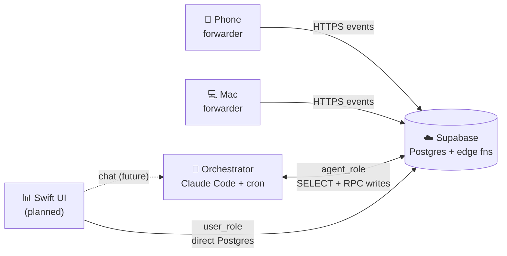
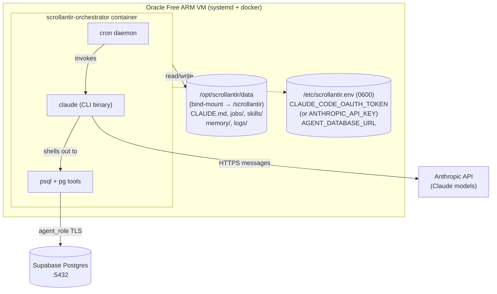

# Scrollantir — Orchestrator setup plan (POC)

> **Status note (2026-04-25):** This doc describes the **current
> production orchestrator** running on Hetzner CAX11 + systemd —
> a successful POC that's writing daily-digest + weekly-report
> reports on cron. Forward work moves into `runtime/` (a fresh
> docker-compose stack). For the rebuild spec, read
> [rebuild-plan.md](rebuild-plan.md) first; this doc is the
> historical-and-current contract for the in-flight POC.

The reasoning plane. A single always-on container running Claude Code
CLI as a cron-invoked agent, with persistent local FS for skills and
memory. No custom Python agent loop, no edge functions, no n8n.

Read `../data-flow.md` first for where this fits overall.

## Status

🚧 Phases 0 and 1 complete (2026-04-21). Phases 2 and 3 pending.

- **Phase 0 ✅** — local Claude Code wrote first daily-digest report
  (`public.reports.id = c93d8d69-8f1a-42ff-b4bb-57755bb18ec1`).
- **Phase 1 ✅** — cold-container `smoke` + `daily-digest` both write
  reports identical in shape to Phase 0.
  - Smoke: `a06e7c81-1618-487f-b228-c1981e2e1f41` (tag `{smoke}`).
  - Daily-digest: `26862d14-6e45-4158-9bd4-1cc3a712c8cf` (tag `{daily}`,
    24h window, 1740-char body).
- **Phase 2** — blocked on explicit user OK to provision Oracle Free
  tier.
- **Phase 3** — blocked on Phase 2 soak time.

## Why this shape (one-line version)

Claude Code CLI already implements tool-use loops, streaming,
self-correction, and a skills/memory filesystem convention. Using
anything else means rebuilding those primitives. Cron plus a
container plus a `CLAUDE.md` is the whole orchestrator.

## Five-entity view



## Detailed flow (inside the orchestrator)



## Plan (four phases, each checkpoint-testable)

### Phase 0: local-first proof

Goal: prove the agent can read from Supabase and write a report,
before provisioning any VPS. Zero infra cost for this phase.

1. Make sure `./admin setup-roles` has run and `scrollantir/agent-role`
   is in your Mac Keychain.
2. Export the DSN once per shell:
   `export AGENT_DATABASE_URL="$(security find-generic-password -s scrollantir -a agent-role -w)"`
3. Make a scratch workspace outside the repo (or under `scratch/`,
   gitignored):
   ```
   ~/scrollantir-scratch/
   ├── CLAUDE.md                   # agent conventions (copy from "CLAUDE.md template" below)
   ├── jobs/
   │   └── daily-digest.md         # prompt template
   └── memory/                     # empty
   ```
4. Run Claude Code interactively in that dir:
   `cd ~/scrollantir-scratch && claude`
5. Say: *"Run the daily-digest job for the last 24 hours. The job
   prompt is in jobs/daily-digest.md."*
6. Watch it query via psql, reason, and (after you approve) write a
   report via `agent_api.upsert_report`. Iterate on the prompt and
   CLAUDE.md until the output is useful.

**Exit criterion:** one real report landed in `public.reports` from
your laptop, written by the agent reading real data. If you can't
get here, the Docker version won't work either.

### Phase 1: containerize (still local)

Goal: same job, now running from a local Docker container on your Mac.
Shakes out the image before you pay the VPS context-switch tax.

1. Copy the scratch workspace into the repo at `orchestrator/`
   (versioned). Final layout:
   ```
   orchestrator/
   ├── Dockerfile
   ├── entrypoint.sh
   ├── run-job.sh
   ├── crontab.template
   └── runtime/              # COPY'd into image at /app/runtime/
       ├── CLAUDE.md
       ├── jobs/
       │   ├── smoke.md
       │   ├── daily-digest.md
       │   └── weekly-report.md
       └── skills/           # empty to start; grows over time
   ```
   `memory/` and `logs/` are runtime-only — never in git, never in
   `runtime/`. The rsync bootstrap populates them on the volume.
2. Build the image (see "Container contents" below).
3. One-shot smoke run — no cron, just the job:
   ```
   docker run --rm \
     -e CLAUDE_CODE_OAUTH_TOKEN \
     -e AGENT_DATABASE_URL \
     -v scrollantir-data:/scrollantir \
     scrollantir-orchestrator \
     smoke
   ```
   (`smoke` runs `jobs/smoke.md` — a trivial "SELECT 1 and write a
   one-line report tagged `['smoke']`" prompt you add to catch
   wiring issues cheaply. Swap `CLAUDE_CODE_OAUTH_TOKEN` for
   `ANTHROPIC_API_KEY` to use a raw API key instead; `entrypoint.sh`
   accepts either.)
4. Verify logs in the mounted volume + a new smoke-tagged report in
   Postgres.
5. Run `daily-digest` once the same way to confirm the real job works
   against real data.

**Exit criterion:** cold-container `smoke` + `daily-digest` both
produce reports identical in shape to Phase 0.

### Phase 2: Oracle Free + systemd deploy

Goal: same container, now running on the VPS, triggered by cron.

Earlier drafts of this doc used Coolify; we ended up not needing it.
For a single container with no inbound HTTPS, systemd + a plain
`docker run` is fewer moving parts, zero extra RAM, and no second
control plane to patch. Coolify becomes worth it if you later host
3+ services on the same VM.

Artifacts in `orchestrator/systemd/` that this flow uses:
- `scrollantir-orchestrator.service` — systemd unit.
- `scrollantir.env.example` — template for `/etc/scrollantir.env`.

Plus two helpers at `orchestrator/`:
- `deploy.sh` — git pull + docker build + `systemctl restart` over SSH.
- `sync-runtime.sh` — rsync `runtime/` to the VM's bind-mount for
  prompt-only iteration (no restart, no rebuild).

#### 2.1 Provision the VM

1. Oracle Cloud Always Free ARM (Ampere Altra, Ubuntu LTS). Capacity
   is often tight at instance-creation time ("Out of host capacity");
   retry in off-peak hours or try a different home region. Once
   provisioned, the VM is stable — availability pain is at boot, not
   runtime.
2. Open only SSH (22) inbound. No HTTP needed.
3. Set up an SSH alias (e.g. `Host orch` in `~/.ssh/config`) so the
   helper scripts can ssh without flags.

#### 2.2 First-time bootstrap on the VM

```bash
# Install Docker CE from Docker's apt repo (gives you /usr/bin/docker
# and the modern `docker compose` plugin). Follow docker.com's current
# Ubuntu install doc; the snap package is NOT recommended.
sudo apt-get update && sudo apt-get install -y git rsync

# Let the login user run docker without sudo (takes effect on next login).
sudo usermod -aG docker "$USER"

# Clone the repo and prepare the bind-mount.
sudo mkdir -p /opt/scrollantir
sudo chown "$USER:$USER" /opt/scrollantir
git clone https://github.com/joshua/scrollantir /opt/scrollantir/repo
sudo mkdir -p /opt/scrollantir/data

# Drop the env file with the two secrets.
sudo install -m 600 -o root -g root \
  /opt/scrollantir/repo/orchestrator/systemd/scrollantir.env.example \
  /etc/scrollantir.env
sudo $EDITOR /etc/scrollantir.env   # fill in CLAUDE_CODE_OAUTH_TOKEN + AGENT_DATABASE_URL

# Install the systemd unit.
sudo install -m 644 \
  /opt/scrollantir/repo/orchestrator/systemd/scrollantir-orchestrator.service \
  /etc/systemd/system/
sudo systemctl daemon-reload

# First build.
cd /opt/scrollantir/repo && docker build -t scrollantir-orchestrator orchestrator/

# Bring it up.
sudo systemctl enable --now scrollantir-orchestrator
```

#### 2.3 Validate immediately — don't wait 24 h

```bash
# On the VM:
docker exec scrollantir-orchestrator /usr/local/bin/run-job.sh smoke
docker exec scrollantir-orchestrator /usr/local/bin/run-job.sh daily-digest

# Confirm the crontab was rendered with secrets redacted:
docker exec scrollantir-orchestrator \
  grep -vE '^(CLAUDE_CODE_OAUTH_TOKEN|ANTHROPIC_API_KEY|AGENT_DATABASE_URL)=' \
  /etc/cron.d/scrollantir

# Confirm cron is actually running inside the container:
docker exec scrollantir-orchestrator pgrep -af cron

# Tail per-run logs from the host (no docker exec needed):
sudo tail -n 50 /opt/scrollantir/data/logs/daily-digest-*.log
sudo tail -n 5  /opt/scrollantir/data/memory/log.md
```

`docker logs scrollantir-orchestrator` shows only the cron-daemon
startup — cron sends per-job output to syslog on Ubuntu (Debian bug
#887035), so use the per-run files under
`/opt/scrollantir/data/logs/` for that.

#### 2.4 Update paths

Two tiers, optimized for different change rates:

| Change | Tool | Time | Restart? |
|---|---|---|---|
| `runtime/jobs/*.md`, `runtime/CLAUDE.md`, `runtime/skills/*` | `./orchestrator/sync-runtime.sh` | ~2 s | No |
| Dockerfile, entrypoint.sh, run-job.sh, crontab.template, image bumps | `./orchestrator/deploy.sh` | ~1 min | Yes (systemd restart) |

Both run from your Mac. Prereq: `export SCROLLANTIR_VM=orch` (ssh alias).

`sync-runtime.sh` rsyncs directly into the bind-mount, so the next
cron tick picks up the new prompt with no restart. The container's
own rsync-on-boot uses `--ignore-existing` — meaning it won't
overwrite your synced prompts on a restart either. The agent's
`memory/` and `logs/` are never touched by the sync.

`deploy.sh` does `git pull`, `docker build`, `systemctl restart`,
and a smoke run as a post-deploy gate.

#### 2.5 Steady state

Let cron take over. Next morning, on the VM:

```bash
sudo cat /opt/scrollantir/data/memory/last-success-daily-digest
sudo tail -10 /opt/scrollantir/data/memory/log.md
psql "$AGENT_DATABASE_URL" -c \
  "SELECT id, title, created_at FROM public.reports
   WHERE 'daily' = ANY(tags) ORDER BY created_at DESC LIMIT 3"
```

**Exit criterion:** smoke + manual daily-digest pass inside 10
minutes of deploy. Cron-triggered digest lands the next morning
without intervention — and again the morning after.

### Phase 3: add the rest

Once daily-digest is stable, layer on:
- `weekly-report.md` — same shape, 7-day window, runs Sunday 9am.
- (deferred) `classifier.md` — depends on roadmap #8 projects schema.
- (deferred) `prompt-asker.md` — depends on what you want to be asked.
- (deferred) chat HTTP endpoint — depends on Swift app existing.

Each is an additive change: a new `jobs/*.md` + a new crontab line.

## Container contents

### Dockerfile (sketch, ~20 lines)

```
FROM ubuntu:24.04

ENV TZ=America/Chicago \
    DEBIAN_FRONTEND=noninteractive

RUN apt-get update && apt-get install -y --no-install-recommends \
      ca-certificates curl gnupg tzdata rsync \
      postgresql-client cron \
      python3 nodejs npm tini \
    && ln -sf /usr/share/zoneinfo/$TZ /etc/localtime \
    && echo "$TZ" > /etc/timezone \
    && rm -rf /var/lib/apt/lists/*

# Claude Code CLI. Two install paths exist today:
#   1. npm: `npm install -g @anthropic-ai/claude-code` — current official package
#   2. native installer (curl-based) — Anthropic's newer recommendation, leaner image
# Pick whichever the CLI's install docs currently point at when you
# actually build this. Both work; npm is shown for concreteness.
RUN npm install -g @anthropic-ai/claude-code

# Versioned runtime files live at /app/runtime in the image. At
# container start, entrypoint.sh copies anything missing from there
# into /scrollantir (the mounted volume), so upgrades ship with the
# image but first-boot still populates an empty volume.
COPY runtime/             /app/runtime/
COPY entrypoint.sh        /usr/local/bin/entrypoint.sh
COPY run-job.sh           /usr/local/bin/run-job.sh
COPY crontab.template     /etc/cron.d/scrollantir.template
RUN chmod +x /usr/local/bin/entrypoint.sh /usr/local/bin/run-job.sh

WORKDIR /scrollantir
ENTRYPOINT ["tini", "--", "/usr/local/bin/entrypoint.sh"]
CMD ["cron-foreground"]
```

Notes:
- `tini` as PID 1 so cron signals propagate cleanly.
- `TZ=America/Chicago` + symlinked `/etc/localtime` is the **only**
  way to get cron to use local time on Ubuntu 24.04. Debian's cron
  package does *not* implement per-crontab `CRON_TZ`. Set the
  container TZ and cron honors it; do not try `CRON_TZ` directives.
- ARM64 on Oracle; `ubuntu:24.04`, Node, postgresql-client, tini all
  ship multi-arch.
- Verify the Claude Code install path against whatever Anthropic's
  current docs recommend at build time — npm vs. native installer.
- Your repo's `orchestrator/runtime/` directory is what ends up at
  `/app/runtime/`. Structure: `CLAUDE.md`, `jobs/*.md`, `skills/`,
  and `.claude/settings.json`. Non-versioned state (`memory/`,
  `logs/`) is never in this tree.
- **`runtime/.claude/settings.json`** ships an explicit Claude Code
  permission allowlist (`Bash`, `Edit`, `Write`, `Read`, `Glob`,
  `Grep`). This is the container's equivalent of the bypass-mode
  setting on your Mac. `defaultMode: bypassPermissions` looks
  cleaner but Claude Code refuses it when running as root — which
  is the container's default. An explicit allowlist sidesteps the
  root-check and is already tight (the container is the sandbox
  boundary; the agent has `agent_role` credentials and nothing else).

### entrypoint.sh

```
#!/usr/bin/env bash
# Runs as PID 1 under tini. Two modes:
#   cron-foreground (default)  — populate volume + assemble crontab + launch `cron -f`
#   <job-name>                 — run one job once and exit (smoke/manual)
set -euo pipefail

: "${AGENT_DATABASE_URL:?missing}"
# Either CLAUDE_CODE_OAUTH_TOKEN (subscription) or ANTHROPIC_API_KEY
# (raw API) must be set; entrypoint.sh propagates whichever is
# present into the crontab env. See §Secrets handling.
[[ -n "${CLAUDE_CODE_OAUTH_TOKEN:-}${ANTHROPIC_API_KEY:-}" ]] \
  || { echo "need CLAUDE_CODE_OAUTH_TOKEN or ANTHROPIC_API_KEY" >&2; exit 1; }

# Populate /scrollantir from versioned image contents on first boot
# (or when files are added in later image releases). rsync with
# --ignore-existing means user-edited files in the mounted volume
# are preserved across redeploys — operators can live-edit prompts
# without rebuilding.
rsync -a --ignore-existing /app/runtime/ /scrollantir/

# Create state directories with tight perms. `install -d` creates
# missing dirs with the given mode; `chmod` afterwards enforces the
# mode on dirs that already existed (e.g. upgrades from older images
# that didn't set them).
install -d -m 700 /scrollantir/logs /scrollantir/memory
chmod 700         /scrollantir/logs /scrollantir/memory

# Build ~/.pgpass so `psql` never prompts. The DSN's user, password,
# and database name may all be percent-encoded and may contain ':'
# or '\', both of which need to be backslash-escaped in .pgpass.
python3 - <<'PY' > /root/.pgpass
import os, urllib.parse as p
u = p.urlparse(os.environ["AGENT_DATABASE_URL"])
def esc(s: str) -> str:
    return (s or "").replace("\\", "\\\\").replace(":", "\\:")
raw_db = p.unquote((u.path or "/postgres").lstrip("/") or "postgres")
print(":".join([
    esc(u.hostname or ""),
    str(u.port or 5432),
    esc(raw_db),
    esc(p.unquote(u.username or "")),
    esc(p.unquote(u.password or "")),
]))
PY
chmod 600 /root/.pgpass

# Render the runtime crontab. Cron parses KEY=VALUE lines at the top
# of its crontab and applies them to every job — that's the only
# reliable way to get env vars into cron jobs. Note: NO CRON_TZ here;
# Ubuntu's cron doesn't support it. Container-wide TZ set in Dockerfile.
{
  printf 'SHELL=%s\n' /bin/bash
  printf 'PATH=%s\n'  /usr/local/bin:/usr/local/sbin:/usr/bin:/usr/sbin:/bin:/sbin
  printf 'ANTHROPIC_API_KEY=%s\n'  "$ANTHROPIC_API_KEY"
  printf 'AGENT_DATABASE_URL=%s\n' "$AGENT_DATABASE_URL"
  printf '\n'
  cat /etc/cron.d/scrollantir.template
} > /etc/cron.d/scrollantir
chmod 0600 /etc/cron.d/scrollantir   # contains secrets

case "${1:-cron-foreground}" in
  cron-foreground)
    exec cron -f          # Ubuntu's cron sends job metadata to syslog,
                          # not stdout. Use last-success markers to
                          # tell if a job actually ran.
    ;;
  daily-digest|weekly-report|classifier|smoke)
    exec /usr/local/bin/run-job.sh "$1"
    ;;
  *)
    echo "unknown command: $1" >&2
    exit 2
    ;;
esac
```

Pin:
- At runtime, secrets live in three places inside the container:
  the process env (inherited from `/etc/scrollantir.env` via
  `--env-file`), `/etc/cron.d/scrollantir` (mode 0600, contains full
  DSN + token so cron jobs inherit them), and `/root/.pgpass`
  (mode 0600, contains only the DB password split into PGPASS
  fields). The bind-mount volume `/scrollantir/*` (i.e.
  `/opt/scrollantir/data/*` on the host) never touches secrets.
- Timezone handling: container-wide `TZ=America/Chicago` (Dockerfile
  ENV + `/etc/localtime` symlink). `0 7 * * *` means 7am Chicago
  year-round, DST handled by tzdata. Do NOT add `CRON_TZ` to the
  crontab — Ubuntu's cron silently ignores it.
- Volume bootstrap: `rsync --ignore-existing` populates empty
  volumes on first boot and leaves user-edited files alone on
  subsequent boots. Image upgrades ship new/revised files via the
  `/app/runtime/` layer; to force-overwrite, nuke the specific file
  from `/scrollantir` and restart the container.

### run-job.sh

```
#!/usr/bin/env bash
# Invoked by cron (env inherited from /etc/cron.d/scrollantir) or
# manually via `entrypoint.sh <job>`. Runs one job, logs, records
# last-success marker for health checks.
set -euo pipefail

job="${1:?job name required}"
prompt="/scrollantir/jobs/${job}.md"
log="/scrollantir/logs/${job}-$(date -u +%Y%m%dT%H%M%SZ).log"
last="/scrollantir/memory/last-success-${job}"
trail="/scrollantir/memory/log.md"

# Dirs are created + mode-enforced by entrypoint.sh; this is a
# belt-and-suspenders for a hand-invoked run-job.sh outside the
# normal entrypoint flow.
install -d -m 700 /scrollantir/logs /scrollantir/memory

if [[ ! -f "$prompt" ]]; then
  echo "no prompt at $prompt" | tee -a "$log" >&2
  exit 2
fi

start_ts="$(date -u +%Y-%m-%dT%H:%M:%SZ)"
printf '=== %s start %s ===\n' "$start_ts" "$job" >> "$log"

if claude -p "$(cat "$prompt")" --output-format text >> "$log" 2>&1; then
  date -u +%Y-%m-%dT%H:%M:%SZ > "$last"
  printf -- '- %s %s ok\n' "$start_ts" "$job" >> "$trail"
else
  rc=$?
  printf -- '- %s %s FAILED (rc=%d, see logs/%s)\n' \
    "$start_ts" "$job" "$rc" "$(basename "$log")" >> "$trail"
  exit "$rc"
fi
```

The `last-success-<job>` files are the healthcheck surface: a
monitor (or you) can `stat` them and alert if the mtime is more than
N hours old for a given job. Simpler than a long-lived HTTP endpoint.

### crontab.template

Committed in repo; env vars get prepended by entrypoint.sh at boot.

```
# DO NOT set SHELL/PATH/env here — entrypoint.sh prepends them.
# DO NOT set CRON_TZ — Ubuntu's cron silently ignores it. Container
# TZ comes from `ENV TZ=America/Chicago` + /etc/localtime in Dockerfile.
0 7 * * *  root /usr/local/bin/run-job.sh daily-digest
0 9 * * 0  root /usr/local/bin/run-job.sh weekly-report
# */15 * * * *  root /usr/local/bin/run-job.sh classifier   # enable with roadmap #8
```

Times are in America/Chicago (set container-wide via Dockerfile).

## CLAUDE.md template

The agent's operating manual. Keep it terse; Claude Code reads it
every run.

```
# Scrollantir agent runtime

You are the scrollantir orchestrator. You read from a Supabase
Postgres database as `agent_role`, reason over events, and write
back reports / annotations / prompts via `agent_api.*` RPCs.

## Connection

Use `psql` via `$AGENT_DATABASE_URL`. Password is already in
~/.pgpass; you can call `psql` without prompts. Default query:

    psql "$AGENT_DATABASE_URL" -c "SELECT …"

## What you can read

All of `public.*` via SELECT:
- `events`, `events_enriched` (view), `devices`, `source_tags`
- `reports`, `annotations`, `prompts`

`events_enriched` is the canonical read surface — it joins events
with device metadata and rolls up source_tags as an array.

## What you can write (singleton RPCs only)

- `SELECT agent_api.upsert_report(NULL, title, body, tags,
  window_start, window_end);` — create a report; pass an existing id
  to update.
- `SELECT agent_api.upsert_annotation(NULL, scope, scope_ref, body);`
- `SELECT agent_api.create_prompt(kind, question, context,
  answer_schema, expires_at, asked_by);`
- `SELECT agent_api.soft_delete_report(id);` (and annotation variant)

**You cannot** INSERT/UPDATE/DELETE any table directly. If a query
errors with "permission denied," that's the trust-boundary working
correctly — use the RPC instead.

## Conventions

- Every report has a title and a timestamp window. Weekly reports
  tag `['weekly']`; daily digests tag `['daily']`.
- Write markdown bodies. Use sections (`## Time on phone`, etc.).
- If you observe something worth asking the user about, create a
  prompt rather than guessing. Give it a `context` JSON explaining
  why you're asking.
- When you run a job, append a one-line summary to `memory/log.md`
  with the UTC timestamp, job name, and outcome.
- `skills/` holds reusable Python/shell snippets and notes. If
  `skills/README.md` exists, read it for the inventory before
  reinventing. On a fresh container the directory is empty — that's
  expected.

## What you should NOT do

- Don't try to modify `public.events` directly; it's append-only from
  ingest. If events look wrong, write an annotation explaining what's
  wrong — don't alter history.
- Don't write to `source_tags` — that's user-curated via the Swift
  dashboard.
- Don't hard-delete anything; soft-delete RPCs set `deleted_at`.
- Don't leak `$AGENT_DATABASE_URL` into reports, logs, or messages.
```

## Job prompts

### jobs/daily-digest.md

```
Write today's daily digest (24h window ending now). Steps:

1. `SELECT timestamp_utc, device, source, duration_s, tags
   FROM public.events_enriched
   WHERE timestamp_utc > NOW() - INTERVAL '24 hours'
   ORDER BY timestamp_utc;`
2. Roll up by (device, source) with total duration; note the top 10.
3. Flag anything unusual compared to `memory/baselines.md` (if it
   exists — read it first). If it doesn't exist, skip the comparison
   and note that baselines need building.
4. Write a 150-300 word markdown report with these sections:
   - Summary (2-3 sentences)
   - Top apps / sources
   - Notable patterns or gaps
5. Call `agent_api.upsert_report(NULL, 'Daily digest <YYYY-MM-DD>',
   <body>, ARRAY['daily'], NOW() - INTERVAL '24 hours', NOW())`.
6. Append a log line to `memory/log.md`.

If any step fails, write what happened to
`memory/errors-<date>.md` and stop — do not guess your way through.
```

### jobs/weekly-report.md

Same shape, 7-day window, deeper patterns, tag `['weekly']`. Reference
the last 7 daily-digests from `public.reports` as prior context.

### jobs/smoke.md

A trivial job used as a wiring check (Phase 1 and Phase 2). The point
is *only* to exercise the full path: env vars set, DSN resolves,
`psql` connects, Claude Code writes one tiny report via the RPC.

```
Run a smoke test. Do exactly:
1. `psql "$AGENT_DATABASE_URL" -c "SELECT 1"` — confirm DB connect.
2. Call `agent_api.upsert_report(NULL, 'smoke <UTC timestamp>',
   'ok', ARRAY['smoke'], NOW(), NOW())`.
3. Print the new report id to stdout.

If either step fails, print the error and exit non-zero.
```

## DB access

`psql` via the agent's bash tool, full stop. `~/.pgpass` is written
by entrypoint.sh so there's no password prompting. The agent writes
SQL as strings and executes `psql "$AGENT_DATABASE_URL" -c "…"`.

Debuggability bonus: you can `ssh` into the VM, `docker exec` into
the container, run the same `psql` command, and see exactly what the
agent sees. No need for a tooling abstraction in the way.

If SQL-as-string ever becomes a real pain point, the Postgres MCP
server is the upgrade path. Don't pre-build it.

## Secrets handling

At rest the secrets live in `/etc/scrollantir.env` on the VM only
(mode 0600, root-owned). At runtime, each is reconstituted into two
or three in-container locations so the process env, cron, and
`psql` can all consume them:

| Secret | At rest | Runtime exposure |
|---|---|---|
| `CLAUDE_CODE_OAUTH_TOKEN` **or** `ANTHROPIC_API_KEY` | `/etc/scrollantir.env` | `/etc/cron.d/scrollantir` (0600); process env |
| `AGENT_DATABASE_URL` | `/etc/scrollantir.env` | `/etc/cron.d/scrollantir` (0600); `/root/.pgpass` (0600); process env |

Auth for Claude Code: either env var works. Defaults:

- **`CLAUDE_CODE_OAUTH_TOKEN`** (preferred) — a long-lived
  subscription-backed token from `claude setup-token` run on your
  Mac. No per-token billing; uses your existing Max plan.
- **`ANTHROPIC_API_KEY`** — raw API key from console.anthropic.com.
  Pay-per-token. Useful if you ever want the orchestrator to run
  under a separate billing entity.

`entrypoint.sh` requires *at least one* of these to be set and
propagates whichever are present into the crontab env. Switching
billing models at any point is a one-line edit to
`/etc/scrollantir.env` + `systemctl restart` — no image rebuild,
no code change.

**What's deliberately NOT a surface:**
- `/scrollantir/*` (mounted volume) — agent-written notes + logs.
  Should never contain secrets. Enforce by review; there's no
  automatic scrubber.
- Docker image layers — no secret baked in. `ENV` only for
  non-sensitive config.
- Git — nothing sensitive in `orchestrator/` source.

**Hazard to watch for:** the agent can echo `$AGENT_DATABASE_URL`
into a log file or a report if it's sloppy. The CLAUDE.md template
has a "do not leak the DSN" rule, but that's soft enforcement.
Concrete mitigations already in entrypoint.sh: `install -d -m 700`
on `/scrollantir/logs` and `/scrollantir/memory`. Also: don't
`docker cp` log files out casually, and review any bug-report
bundles before sharing.

**Rotation drill** (whenever you run `./admin setup-roles`):
1. Run `./admin setup-roles` locally — rotates DB passwords, updates
   `scrollantir/agent-role` in Keychain.
2. Extract the new DSN:
   `security find-generic-password -s scrollantir -a agent-role -w`
3. SSH in and edit `/etc/scrollantir.env`:
   `ssh $SCROLLANTIR_VM sudo $EDITOR /etc/scrollantir.env`
4. `ssh $SCROLLANTIR_VM sudo systemctl restart scrollantir-orchestrator`
5. Confirm: `ssh $SCROLLANTIR_VM sudo docker exec scrollantir-orchestrator run-job.sh smoke`

**Known annoyance:** step 2-4 is manual and you *will* forget a
rotation eventually. A reasonable small improvement to the admin
CLI later: `./admin export --role agent-role --target remote --host
$SCROLLANTIR_VM` that writes `/etc/scrollantir.env` over SSH and
kicks the unit. Not worth building now.

## Observability

Keep it dumb for MVP:
- Each job writes to `/scrollantir/logs/<job>-<utc>.log` (dir mode 700).
- `memory/log.md` gets a one-line summary per run.
- `memory/last-success-<job>` is a single-timestamp file written
  only on success. This is the canonical healthcheck surface.

**`docker logs` is not a reliable signal.** Ubuntu's cron package
sends job metadata to syslog, not container stdout. You'll see the
cron daemon start, but not the per-job output. Don't try to debug
job failures with `docker logs`; check the per-run files in
`/scrollantir/logs/` and the `last-success-<job>` markers instead.

**Manual triggers** (debug / test a prompt change / catch up after
downtime):

```
docker exec scrollantir-orchestrator run-job.sh daily-digest
docker exec scrollantir-orchestrator run-job.sh smoke
```

`smoke` is your cheap "does everything still work" button — see
`jobs/smoke.md`.

**Healthcheck (optional, later):** a `healthcheck.sh` that checks
each `last-success-<job>` mtime against the expected cadence and
exits non-zero if any is stale. Point an uptime monitor at a simple
`docker exec … healthcheck.sh`.

**Rollback:** the image is built from git on the VM, so rolling back
is `git checkout <prior-sha>` in `/opt/scrollantir/repo`, then
`docker build` + `systemctl restart`. The bind-mount survives, so
`memory/` and `logs/` stay intact. If you want a safety-net to pin
to a known-good build, `docker tag scrollantir-orchestrator
scrollantir-orchestrator:known-good` after each clean deploy and
retag to `:latest` on rollback. Premature for v1.

## Risks and gotchas

1. **Claude Code install path drifts.** Package name today is
   `@anthropic-ai/claude-code` on npm; Anthropic also ships a native
   installer. Check the current install docs at build time and swap
   whichever one the official page currently recommends.
2. **Cron environment.** Cron runs with a stripped env *and* a
   stripped `PATH`. entrypoint.sh addresses both by prepending
   `SHELL`, `PATH`, `CLAUDE_CODE_OAUTH_TOKEN` / `ANTHROPIC_API_KEY`,
   and `AGENT_DATABASE_URL` into the crontab file — which is the
   only reliable way to get env vars and binaries visible to cron
   jobs. Don't try to `ENV` in the Dockerfile and expect it to
   survive.
3. **Timezone.** Ubuntu 24.04's cron package does **not** honor
   `CRON_TZ` directives inside the crontab. Set the container TZ
   via `ENV TZ=America/Chicago` + `/etc/localtime` symlink at image
   build time; cron then reads schedules in local time. Do not add
   `CRON_TZ` to the crontab — it silently no-ops.
4. **Token cost drift.** An agent that over-enthusiastically queries
   the whole events table will burn tokens. Constrain queries via
   `LIMIT` + a time window inside each job prompt. Use Sonnet 4.6 by
   default; bump to Opus only if a job's output quality demands it.
   Daily+weekly on Sonnet is probably $5-15/month at steady state.
5. **Orchestrator down ≠ data loss.** Device forwarders keep queuing
   locally; Supabase keeps accepting events. You just miss a digest
   or two. No backpressure into the hot path.
6. **Reports accumulate forever.** No auto-purge yet. Fine for year
   one; add a cleanup cron when `public.reports` table-size becomes
   a concern.

## Open questions (still)

1. **`AGENT_DATABASE_URL` delivery.** Manual paste into
   `/etc/scrollantir.env` on the VM is fine for MVP. Worth a small
   enhancement to `./admin setup-roles` that also prints the
   agent-role DSN (like it does for ingest_role) so you don't have
   to `security find-generic-password` it out. A further step: an
   `admin export --role agent-role --target remote --host
   $SCROLLANTIR_VM` subcommand that edits the VM's env file over
   SSH and kicks the unit.
2. **Chat transport** (SSE vs. WebSocket) — decide when Swift is being
   built, not now.
3. **Classifier cadence** — batches vs. LISTEN/NOTIFY — decide when
   projects (roadmap #8) is being built.
4. **Prompt-asker** design — the question taxonomy needs user input;
   defer to v2.

## Related

- `docs/data-flow.md` — overall runtime placement, credential map
- `docs/supabase.md` — schema, roles, RPC contracts
- `docs/agent.md` — conventions (predates this doc; largely subsumed
  and needs a pass once the orchestrator ships)
- `docs/roadmap.md` — sequencing (#6 becomes this doc)
- `docs/admin-cli.md` — the CLI that mints `agent_role` credentials
